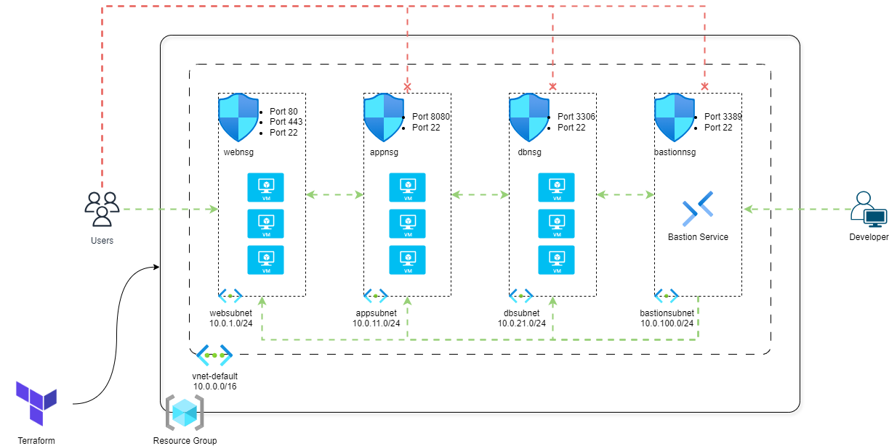

# 03-4-Tier Virtual Network Design

This directory contains Terraform configuration files to create and manage a 4-tier Virtual Network setup in Azure. The configurations include setting up a Virtual Network, defining input variables, and specifying Terraform and provider versions.

## Overview

In this configuration, a 4-tier Virtual Network is created in Azure. The setup includes defining the Virtual Network's name, location, address space, and tags. The configurations are parameterized using input variables for flexibility and reusability.



## Directory Structure

* `c1-versions.tf`: Configures the Terraform version and provider versions.
* `c2-generic-input-variables.tf`: Defines generic input variables for the Terraform configuration.
* `c3-specific-input-variables.tf`: Defines specific input variables related to the 4-tier Virtual Network.
* `c4-local-values.tf`: Defines local values used within the configuration.
* `c5-resource-group.tf`: Defines the resource group in which the Virtual Network and other resources will be created.
* `c6-01-vnet-input-variables.tf`: Inputs related to the vnet.
* `c6-02-virtual-network.tf`: Defines the configuration for creating the Virtual Network in Azure.
* `c6-03-web-subnet-and-nsg.tf`: Defines the web tier subnet and associated network security group.
* `c6-04-app-subnet-and-nsg.tf`: Defines the application tier subnet and associated network security group.
* `c6-05-db-subnet-and-nsg.tf`: Defines the database tier subnet and associated network security group.
* `c6-06-bastion-subnet-and-nsg.tf`: Defines the bastion tier subnet and associated network security group.
* `c6-07-vnet-outputs.tf`: Outputs related to the Virtual Network and its subnets.

## Configuration Files

### `c1-versions.tf`

```hcl
terraform {
  required_version = ">= 0.12"
  required_providers {
    azurerm = {
      source  = "hashicorp/azurerm"
      version = ">= 2.0"
    }
  }
}
```

### `c2-generic-input-variables.tf`

Defines generic input variables for the Terraform configuration.

### `c3-specific-input-variables.tf`

Defines specific input variables related to the 4-tier Virtual Network.

### `c4-local-values.tf`

Defines local values used within the configuration.

### `c5-resource-group.tf`

```hcl
resource "azurerm_resource_group" "rg" {
  name     = var.resource_group_name
  location = var.resource_group_location
}
```

### `c6-01-vnet-input-variables.tf`

Inputs related to the Virtual Network.

### `c6-02-virtual-network.tf`

```hcl
resource "azurerm_virtual_network" "vnet" {
  name                = "${local.resource_name_prefix}-${var.vnet_name}"
  resource_group_name = azurerm_resource_group.rg.name
  location            = azurerm_resource_group.rg.location
  address_space       = var.vnet_address_space
  tags                = local.common_tags
}
```

### `c6-03-web-subnet-and-nsg.tf`

Defines the web tier subnet and associated network security group.

### `c6-04-app-subnet-and-nsg.tf`

Defines the application tier subnet and associated network security group.

### `c6-05-db-subnet-and-nsg.tf`

Defines the database tier subnet and associated network security group.

### `c6-06-bastion-subnet-and-nsg.tf`

Defines the bastion tier subnet and associated network security group.

### `c6-07-vnet-outputs.tf`

```hcl
output "virtual_network_name" {
  description = "The name of the Virtual Network"
  value       = azurerm_virtual_network.vnet.name
}

output "virtual_network_id" {
  description = "The ID of the Virtual Network"
  value       = azurerm_virtual_network.vnet.id
}

output "web_subnet_name" {
  description = "The name of the Web Tier Subnet"
  value       = azurerm_subnet.websubnet.name
}

output "web_subnet_id" {
  description = "The ID of the Web Tier Subnet"
  value       = azurerm_subnet.websubnet.id
}

output "web_subnet_nsg_name" {
  description = "The name of the Web Tier Network Security Group"
  value       = azurerm_network_security_group.webnsg.name
}

output "web_subnet_nsg_id" {
  description = "The ID of the Web Tier Network Security Group"
  value       = azurerm_network_security_group.webnsg.id
}
```

## Usage

1. Clone the repository.
2. Navigate to the `manifests/03-4-tier-vnet-design` directory.
3. Initialize Terraform.
4. Apply the Terraform configuration.

```sh
git clone https://github.com/nilanjanb3/Terraform-On-Azure.git
cd manifests/03-4-tier-vnet-design
terraform init
terraform apply
```

This will create the specified Virtual Network in Azure based on the provided configuration.